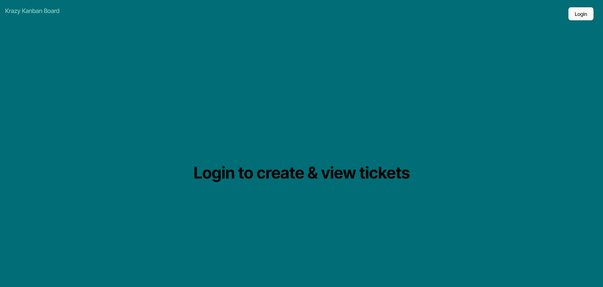
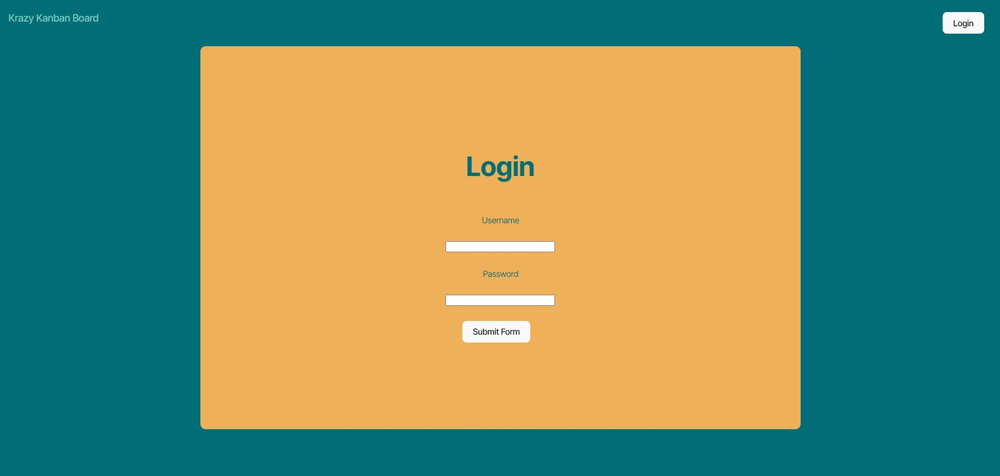
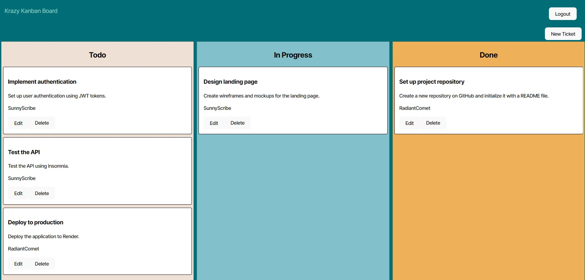
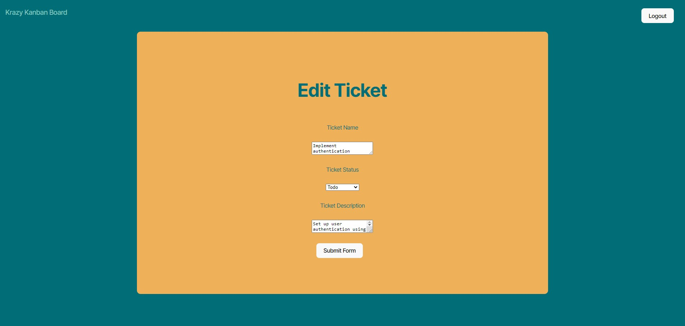
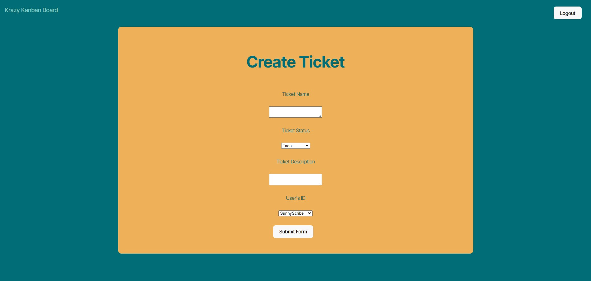

# 

# Kanban-Board

https://kanban-board-nyhn.onrender.com

## Description
I created this Kanban board to make a space for users working on projects to keep track of the various components they are working on and the status they are in at any given time. It is a means of helping multiple users know what is being worked on, what needs to be worked on, and what is already done. This should hopefully avoid issues of people working on the same tasks by accident or working on something that is already completed, making the overall process more efficient.

## Table of Contents
- [Installation](#installation)
- [Usage](#usage)
- [License](#license)
- [Contributing](#contributing)
- [Tests](#tests)
- [Questions](#questions)

## Installation
N/A

## Usage

Upon loading up the page you will be brought initially to the main page which contains a message to login to create and view tickets. There is also a Krazy Kanban Board link that will take you to the board if you are already logged in or send you to the login page if you are not logged in.  There is also a Login button that will take you to the login page.

The login page is pretty straightforward. There is a space to input your username and a space to input your password. Once that is done simply click the Submit form button.  If your username and password are valid you will be brought to the Kanban board page. If it is not you will see an error message pop up below the button.

Once on the board page you will see three columns, the todo, the in progress, and the done columns. Each column has tickets on the that contain a ticket name, description, the username of the assigned ticket, and an edit and delete button. To move a ticket from one column to another, click the edit button to change the status. To delete a ticket simply click the delete button and it will be removed. To create a new ticket, click the new ticket button in the top right corner. There is also a logout button which will log you out and take you back to the login page. Be aware that should the page remain inactive for over one hour you will be logged out.

On the edit ticket you have the option to change the ticket name, the status, and the ticket description. When done click the submit form button.

You have the same options with the create ticket form with the added input field of assigning a user to the ticket.

  ## License
    MIT
    
  https://opensource.org/licenses/MIT

## Contributing
At this time no further contributions are needed.

## Tests
N/A

## Questions
GitHub: [pauletters](https://github.com/pauletters)
Email: pauletters87@gmail.com
